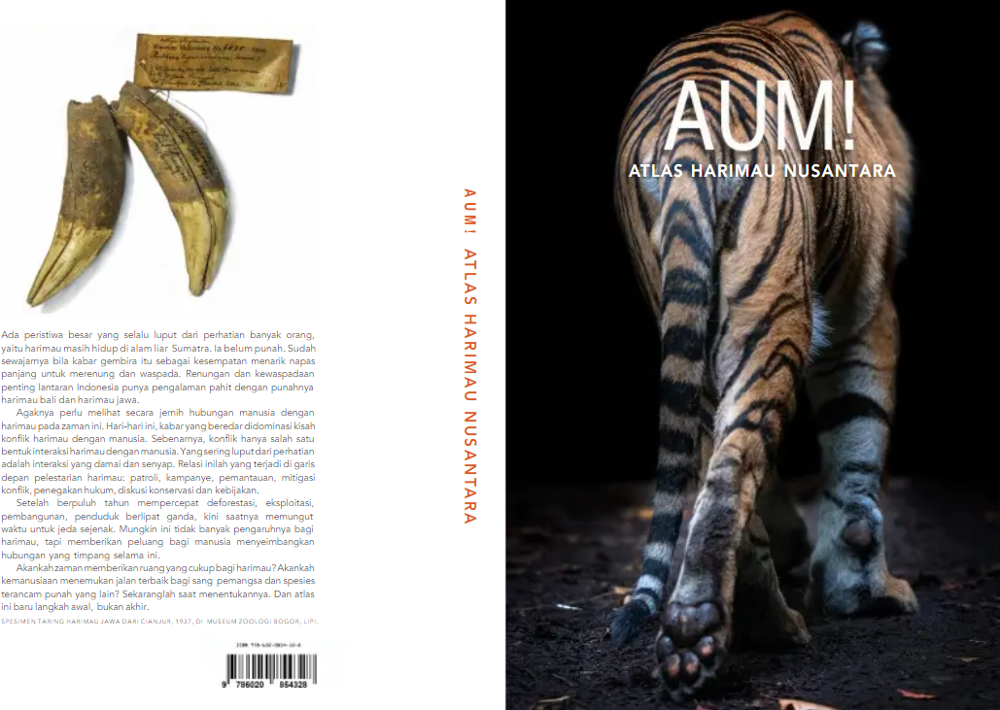

---

### Aum! Atlas Harimau Nusantara (2019)

In the book that provides a comprehensive explanation of Tigers in Indonesia, including their physical characteristics and habitat, spatial distribution, historical and current status, and conservation plans, I served as a co-cartographer who prepared several maps for the book.

This book can be found [here](https://muspera.menlhk.go.id/Perpus_search/detail/24487)